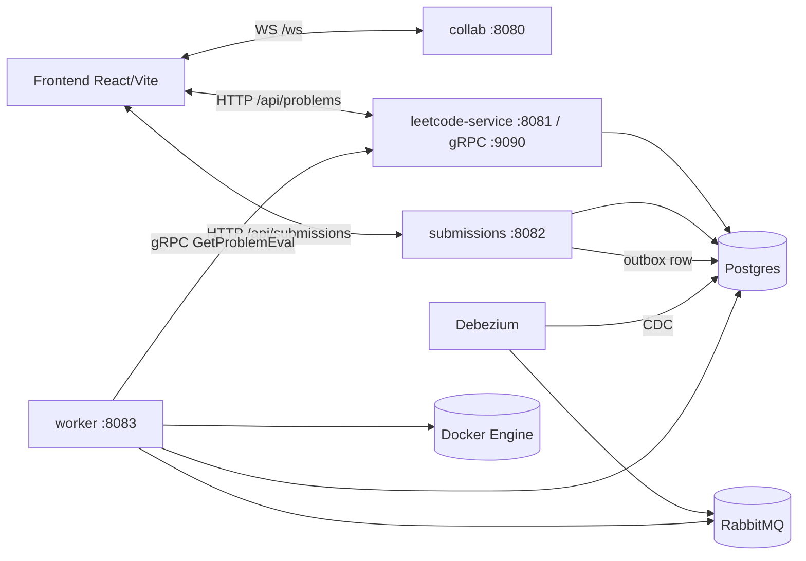

# LeetDoodle

Collaborative algorithm practice workspace with a node-based canvas, real-time presence, and asynchronous code evaluation.

## Why This Project Exists

LeetDoodle combines three things that are usually separate:

- A visual canvas for problem-solving workflows.
- Multiplayer collaboration (presence, cursor, shared node state).
- Production-style evaluation pipeline (transactional outbox, CDC, queue consumer, sandboxed execution).

The goal is to practice algorithm solving and systems design in one place.

## Highlights

- Real-time collaboration over WebSockets (`collab` service).
- Problem catalog with REST + internal gRPC eval-data API (`leetcode-service`).
- Async submissions with transactional outbox (`submissions` service).
- Queue-driven worker execution inside Docker sandboxes (`worker` service).
- Debezium CDC from Postgres outbox to RabbitMQ.

## Architecture At A Glance



More architecture detail lives in [docs/backend](./docs/backend/README.md).

## Repository Layout

```text
frontend/                React + Vite client
services/
  collab/                WebSocket relay
  leetcode/              Problem APIs + gRPC eval metadata service
  submissions/           Submission API + outbox writer
  worker/                Rabbit consumer + Docker eval runner
  grpc-api/              Shared protobuf/gRPC stubs
infra/
  compose/               Docker Compose stack (Postgres, RabbitMQ, Debezium)
  debezium/conf/         Debezium server config
scripts/                 Dev lifecycle scripts
docs/backend/            Architecture, contracts, ADRs, runbooks
```

## Tech Stack

- Frontend: React 19, TypeScript, Vite, CodeMirror
- Backend: Java 21+, Spring Boot 3.4, Maven, gRPC
- Data: PostgreSQL 16
- Messaging: RabbitMQ, Debezium Server (Outbox Router SMT)
- Execution Isolation: Docker containers

## Prerequisites

- Docker + Docker Compose
- Java 21+ (project compiles with `maven.compiler.release=21`)
- Maven 3.9+
- Node.js 20+ and pnpm

## Quick Start (Local Development)

### 1) Start backend services + infra

```bash
./scripts/backend-up.sh
```

This script:

- installs `services/grpc-api` to local Maven cache,
- runs clean Maven startup for each backend service by default (prevents stale `target/classes` issues),
- starts Docker infra (`postgres`, `rabbitmq`, `debezium`),
- starts Spring services (`collab`, `leetcode`, `submissions`, `worker`),
- writes logs to `.logs/` and PIDs to `.run/`.

If you need a faster startup and are okay skipping clean rebuilds:

```bash
./scripts/backend-up.sh --no-clean
```

### 2) Start frontend

```bash
cd frontend
pnpm install
pnpm dev
```

Frontend runs on Vite default (`http://localhost:5173`).

### 3) Open the app

- `http://localhost:5173`

## Service Endpoints

| Component | Port | Purpose |
| --- | --- | --- |
| frontend (Vite) | `5173` | UI |
| collab | `8080` | WebSocket relay (`/ws`) |
| leetcode-service (HTTP) | `8081` | Problems REST API |
| leetcode-service (gRPC) | `9090` | Worker eval metadata API |
| submissions | `8082` | Submission create/poll API |
| worker | `8083` | Worker process (internal APIs) |
| postgres | `5432` | Primary DB |
| rabbitmq | `5672` | AMQP |
| rabbitmq mgmt | `15672` | Rabbit UI |

## Core Developer Workflows

### Build/check backend

```bash
mvn -f services/pom.xml -DskipTests compile
```

### Build frontend

```bash
pnpm -C frontend build
```

### Frontend lint (strict)

```bash
pnpm -C frontend lint:all
```

This enforces:

- ESLint with zero warnings (`--max-warnings=0`)
- canonical Tailwind token color class syntax (for example `text-(--token)`)

### Install pre-commit hook

```bash
./scripts/setup-git-hooks.sh
```

After setup, every commit runs `scripts/pre-commit.sh` (currently strict frontend lint checks).

### Stop everything

```bash
./scripts/backend-down.sh
```

To keep infra running while stopping Spring services:

```bash
./scripts/backend-down.sh --keep-infra
```

### Restart backend services

```bash
./scripts/backend-restart.sh
```

Useful flags:

- `--keep-infra` (restart Spring services only, leave Docker infra up)
- `--no-clean` (skip clean rebuild path)

### Infra-only utilities

```bash
./scripts/dev-ps.sh
./scripts/dev-logs.sh
./scripts/dev-down.sh
```

### Reset DB schemas (destructive)

```bash
./scripts/db-reset.sh
```

## API and Contract Docs

- REST: [docs/backend/contracts/rest-api.md](./docs/backend/contracts/rest-api.md)
- gRPC eval API: [docs/backend/contracts/grpc-problem-eval.md](./docs/backend/contracts/grpc-problem-eval.md)
- WebSocket events: [docs/backend/contracts/websocket-events.md](./docs/backend/contracts/websocket-events.md)
- Messaging path: [docs/backend/contracts/eval-messaging.md](./docs/backend/contracts/eval-messaging.md)

## Architecture Decisions (ADRs)

- [ADR-0001: Transactional Outbox + Debezium + RabbitMQ](./docs/backend/adrs/ADR-0001-transactional-outbox-debezium-rabbitmq.md)
- [ADR-0002: Worker Direct DB Access](./docs/backend/adrs/ADR-0002-worker-direct-db-access.md)
- [ADR-0003: Stateful In-Memory Collab Relay](./docs/backend/adrs/ADR-0003-stateful-collab-relay.md)
- [ADR-0004: Worker Reads Eval Data via gRPC](./docs/backend/adrs/ADR-0004-worker-reads-eval-data-via-grpc.md)

## Operational Notes

- `worker` requires a running Docker daemon to execute submissions.
- Debezium depends on Postgres logical replication (`wal_level=logical`) and publishes to RabbitMQ exchange `eval`.
- Submission status is asynchronous by design: client posts, then polls by `submissionId`.

## Contribution Guidelines

When opening a PR:

- Keep docs in sync with behavior changes (`docs/backend` is docs-as-code).
- Update contracts and ADRs when architecture/semantics change.
- Keep backend Javadocs consistent with the team standard: [docs/backend/standards/javadoc-and-teaching-style.md](./docs/backend/standards/javadoc-and-teaching-style.md)

## Status

Active development. Interfaces and schemas may evolve quickly while core architecture stabilizes.
