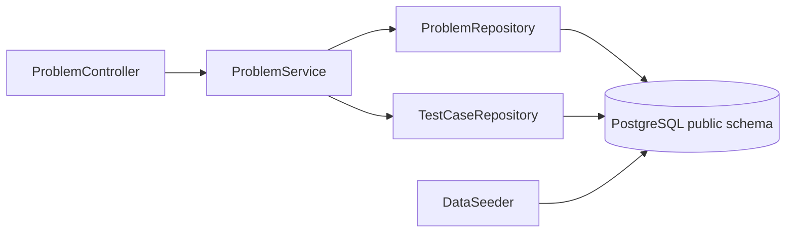
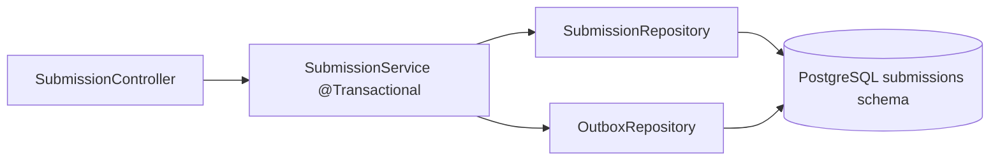
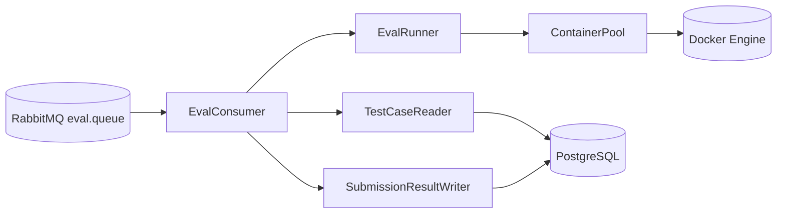
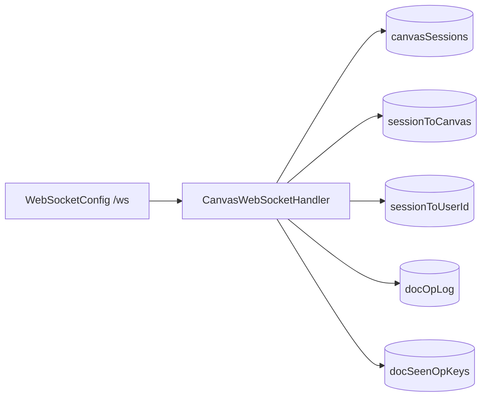
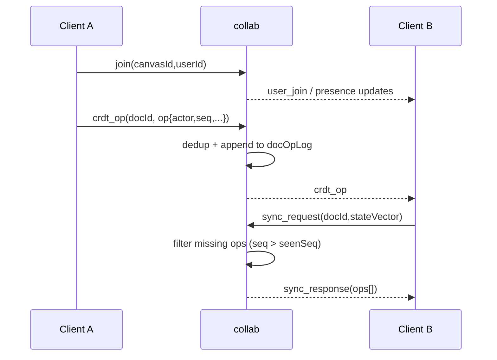

# C4 Level 3: Component View

This page zooms into each Spring service and maps internal components to their runtime responsibilities.

## leetcode-service

- `ProblemController` exposes list/by-slug/test-case endpoints.
- `ProblemService` centralizes retrieval and not-found handling.
- Repositories use SQL via JDBC templates (no ORM).
- `DataSeeder` loads problem/test-case datasets on startup when enabled.

## submissions

- `SubmissionController` handles submit + polling endpoints.
- `SubmissionService.submit()` performs submission insert and outbox insert in one transaction.
- `OutboxRepository` stores `EvalJob` payload for Debezium to publish.

## worker

- `EvalConsumer` orchestrates one job end-to-end from queue message to DB result write.
- `EvalRunner` executes all test cases, handles WA/RE/TLE outcomes.
- `ContainerPool` manages pre-warmed single-use sandbox containers.
- Reader/writer components perform direct SQL reads/writes for eval-path latency.

## collab

- Join flow registers session/user/canvas mappings and broadcasts presence.
- Generic events are relayed as opaque payloads to peers in canvas room.
- `crdt_op` path does dedup + op-log append + broadcast.
- `sync_request` path returns missing ops by state vector.

## Collab Sync Sequence

