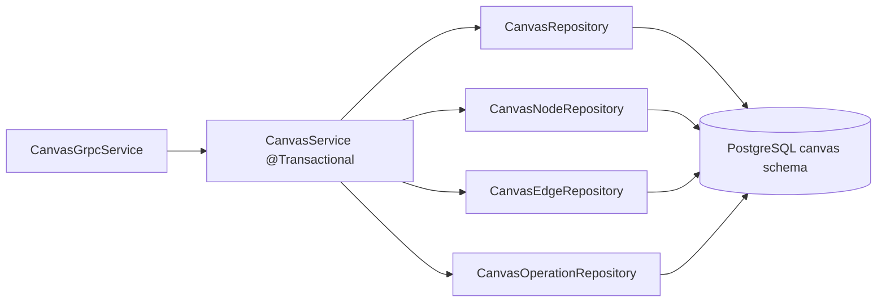
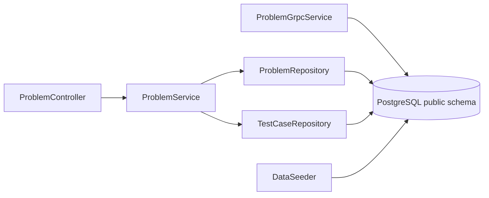
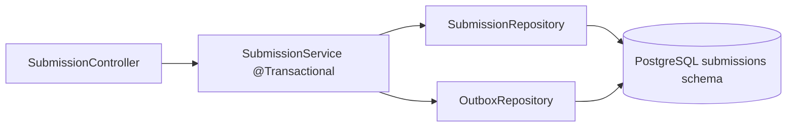
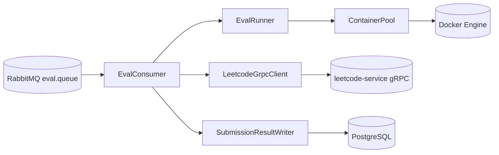
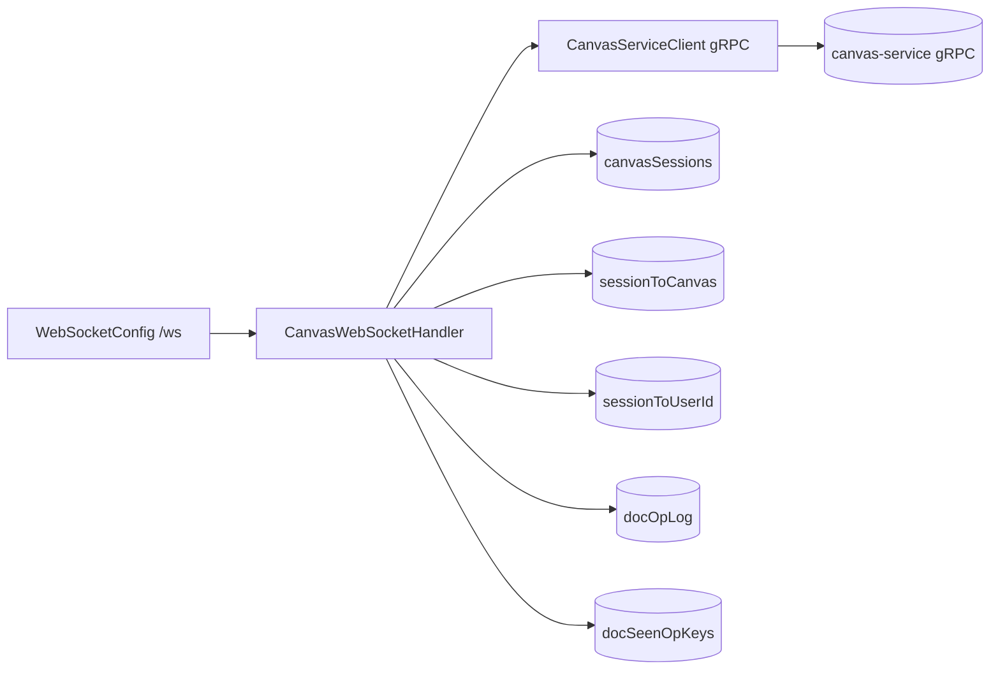
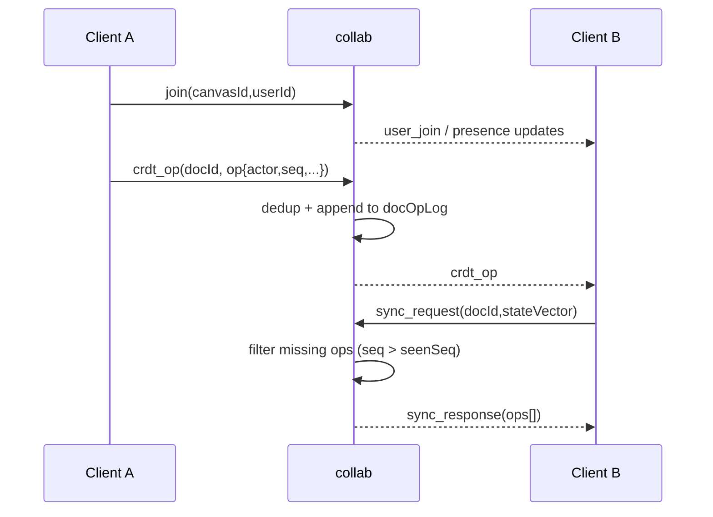

# C4 Level 3: Component View

This page zooms into each Spring service and maps internal components to their runtime responsibilities.

## canvas-service

- `CanvasGrpcService` is the internal service-to-service contract used by collab.
- `CanvasService.applyStructuralOperation()` reserves a new version, appends to `canvas_ops`, applies the materialized write, and commits in one transaction.
- `CanvasRepository` owns canvas-level metadata such as `head_version`.
- `CanvasNodeRepository` and `CanvasEdgeRepository` own the materialized current-state tables.
- `CanvasOperationRepository` owns the ordered recent structural-op log used for catch-up after a known version.

## leetcode-service

- `ProblemController` exposes list/by-slug/test-case HTTP endpoints.
- `ProblemGrpcService` exposes internal `GetProblemEval` endpoint for worker.
- `ProblemService` centralizes retrieval and not-found handling.
- Repositories use SQL via JDBC templates (no ORM).
- `DataSeeder` loads problem/test-case datasets on startup when enabled.

## submissions

- `SubmissionController` handles submit + polling endpoints.
- `SubmissionService.submit()` performs submission insert and outbox insert in one transaction.
- `OutboxRepository` stores and claims `EvalJob` payloads for the scheduler to publish.

## worker

- `EvalConsumer` orchestrates one job end-to-end from queue message to DB result write.
- `LeetcodeGrpcClient` fetches prompt/entryPoint/test-cases from leetcode-service.
- `EvalRunner` executes all test cases, handles WA/RE/TLE outcomes.
- `ContainerPool` manages pre-warmed single-use sandbox containers.
- `SubmissionResultWriter` persists terminal status/result JSON directly to submissions DB.

## collab

- Join flow registers session/user/canvas mappings and broadcasts presence.
- Durable structural events are committed through canvas-service before collab broadcasts them to peers.
- Ephemeral events are still relayed directly in-memory.
- `crdt_op` path does dedup + op-log append + broadcast.
- `sync_request` path returns missing ops by state vector.

## Collab Sync Sequence

