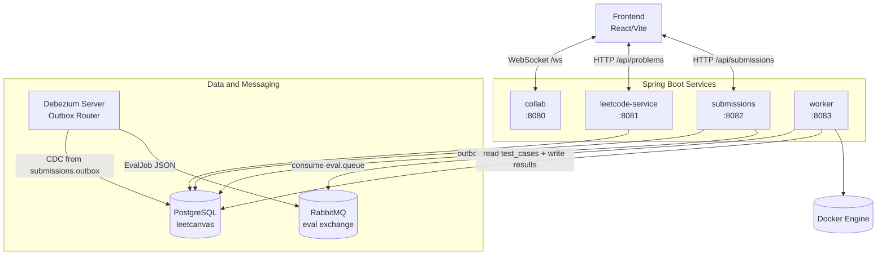
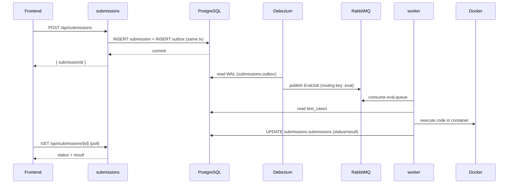

# C4 Level 2: Container View

This view decomposes the backend system into deployable runtime containers/processes.

## Container Responsibilities

- **collab**: Room/session registry, fan-out relay, in-memory CRDT op-log for replay.
- **leetcode-service**: Paginated/filterable problem APIs and test-case fetch API.
- **submissions**: Accepts code submissions, persists row, persists outbox event in same transaction.
- **worker**: Pulls eval jobs, runs code in sandbox containers, writes status/result JSON back.
- **Debezium**: Bridges DB outbox rows to RabbitMQ messages.

## Submission Evaluation Sequence

