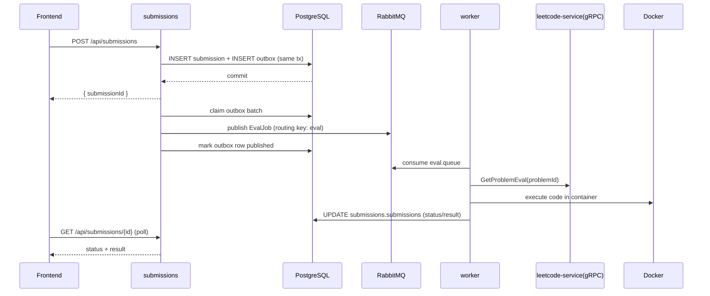

# C4 Level 2: Container View

This view decomposes the backend system into deployable runtime containers/processes.

```mermaid
flowchart TB
    FE[Frontend\nReact/Vite]

    subgraph APP[Spring Boot Services]
      COL[collab\n:8080]
      LEE[leetcode-service\n:8081 (HTTP), :9090 (gRPC)]
      SUB[submissions\n:8082]
      WRK[worker\n:8083]
    end

    subgraph DATA[Data and Messaging]
      PG[(PostgreSQL\nleetdoodle)]
      RMQ[(RabbitMQ\neval exchange)]
    end

    DCK[(Docker Engine)]

    FE <-->|WebSocket /ws| COL
    FE <-->|HTTP /api/problems| LEE
    FE <-->|HTTP /api/submissions| SUB

    LEE --> PG
    SUB --> PG
    SUB -->|outbox row in same tx| PG
    SUB -->|poll unpublished outbox rows| PG
    SUB -->|EvalJob JSON| RMQ
    WRK -->|consume eval.queue| RMQ
    WRK -->|fetch eval metadata + test cases| LEE
    WRK -->|write results| PG
    WRK --> DCK
```

## Container Responsibilities

- **collab**: Room/session registry, fan-out relay, in-memory CRDT op-log for replay.
- **leetcode-service**: Paginated/filterable problem APIs plus internal gRPC eval-data endpoint.
- **submissions**: Accepts code submissions, persists row, persists outbox event in same transaction, and polls/publishes unpublished rows to RabbitMQ.
- **worker**: Pulls eval jobs, calls leetcode gRPC for eval metadata, runs code in sandbox containers, writes status/result JSON back.

## Submission Evaluation Sequence


