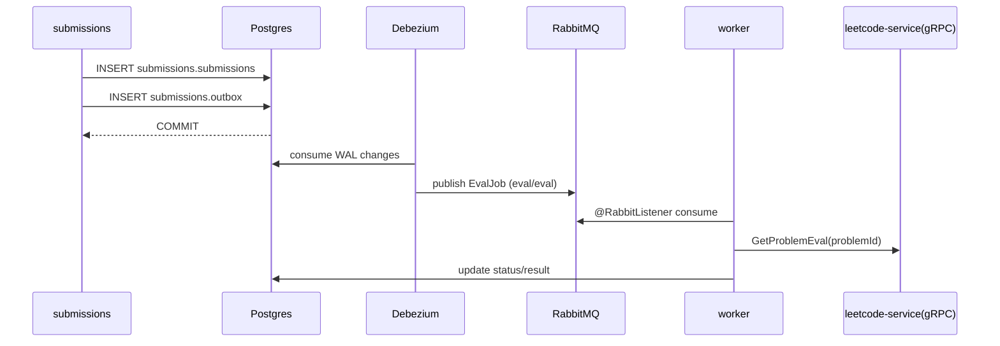

# Eval Messaging Contract (Outbox -> Debezium -> RabbitMQ -> Worker)

This contract defines the asynchronous evaluation path.

## Message Producer and Consumer

- Producer of business intent: `submissions` service (`SubmissionService` + `OutboxRepository`).
- CDC publisher: Debezium Server with Outbox Event Router SMT.
- Queue consumer/orchestrator: `worker` service (`EvalConsumer`).
- Eval-data provider: `leetcode-service` gRPC (`ProblemGrpcService` on `:9090`).

## Rabbit Topology

- Exchange: `eval` (direct)
- Queue: `eval.queue` (durable)
- Routing key: `eval`

These names are declared in:

- `services/submissions/.../RabbitConfig.java`
- `services/worker/.../RabbitConfig.java`

## Payload Contract: `EvalJob`

Wire JSON shape:

```json
{
  "submissionId": "8d9f2b09-1478-42e7-9584-96918987e8cd",
  "problemId": 1,
  "language": "javascript",
  "code": "function twoSum(...) { ... }"
}
```

- Worker model mirrors submissions model exactly (`worker.model.EvalJob`).
- `language` remains on the wire for forward compatibility; current runner path
  executes Python eval scripts using problem-provided `prompt`/`entryPoint`.

## Delivery Semantics

- Submission and outbox rows are inserted in one DB transaction.
- Debezium reads committed outbox rows from WAL and publishes message.
- Worker listener processes one message at a time (`prefetch=1`).
- Worker fetches eval metadata + test cases via gRPC before container execution.
- Listener acknowledges on successful return; failed handler path writes runtime error result.

## Sequence



## Failure and Recovery Notes

- If Debezium is down, outbox rows remain persisted and are published when Debezium resumes.
- If Debezium offset state is lost, old outbox rows may be republished; worker path should remain idempotency-safe at business level.
- If worker throws unexpectedly, message can be re-delivered per RabbitMQ/Spring AMQP behavior.
- If gRPC returns `NOT_FOUND` for missing eval metadata, worker writes `RUNTIME_ERROR` result and returns normally (no requeue loop).
